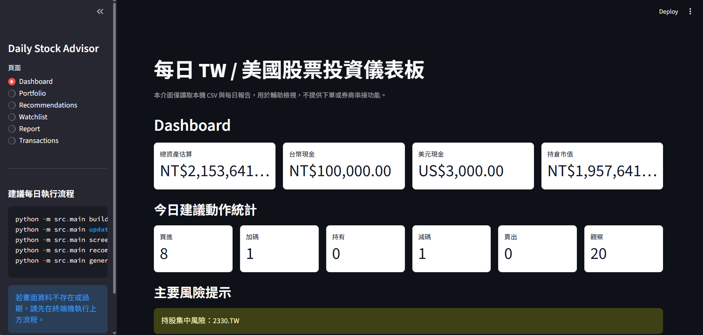
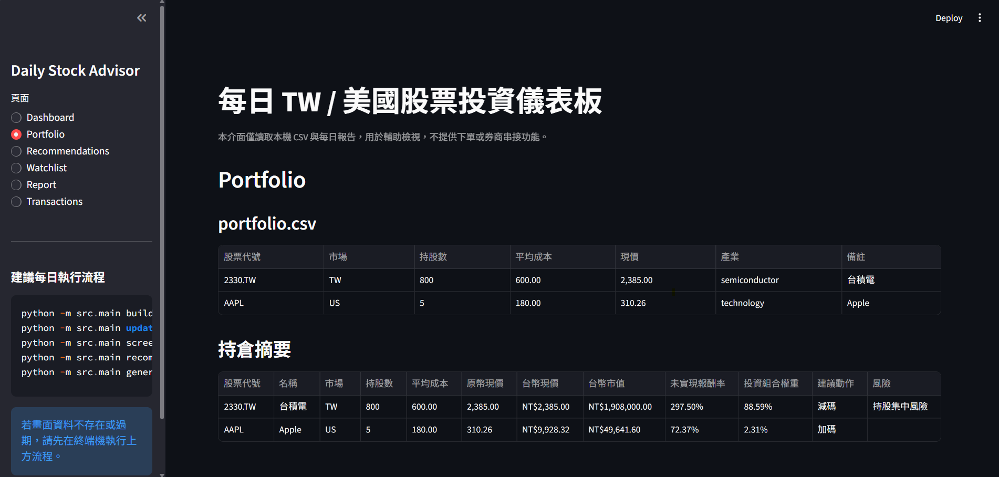
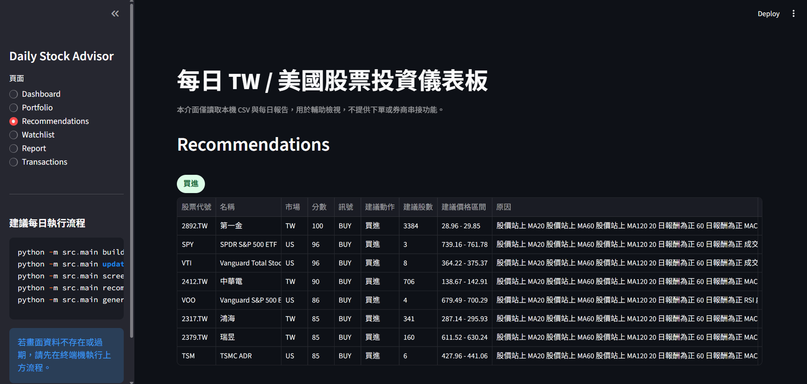
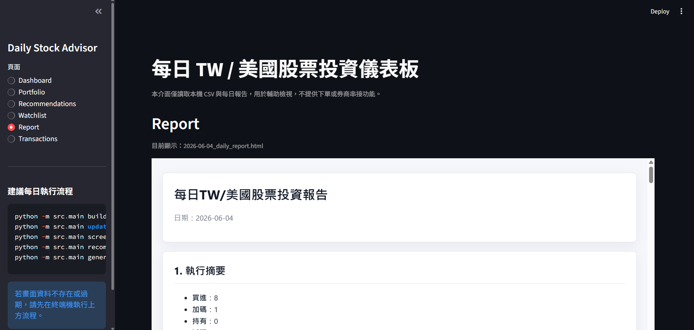

# Daily Stock Advisor

Daily Stock Advisor 是一套本地端台股 / 美股投資決策輔助系統。它會根據使用者的交易流水帳、目前持倉、現金水位、股價資料、技術指標與風險條件，產生每日股票篩選結果、個人化建議、Markdown / HTML 報告，並提供 Streamlit Dashboard 讓使用者用網頁查看資料。

本專案僅供個人研究、學習與投資決策輔助使用，不提供自動下單、券商 API 串接或代客交易功能。所有輸出僅供參考，實際交易須由使用者自行判斷並於券商平台手動執行。

## 功能特色

* 台股 / 美股價格更新
* 交易流水帳產生目前持倉
* 投資組合損益與權重分析
* Rule-based 股票篩選器
* 個人化買進 / 加碼 / 持有 / 減碼 / 賣出 / 觀察建議
* 台幣 / 美元換算
* 每日 Markdown / HTML 中文報告
* Streamlit 本地互動式 Dashboard
* 風險提示與免責聲明

## 快速開始

以下指令以 Windows PowerShell 為例。

### 1. 建立虛擬環境

```powershell
python -m venv .venv
.\.venv\Scripts\Activate.ps1
python -m pip install -r requirements.txt
```

若 VS Code 仍顯示 `import pytest` 或套件無法解析，請確認已選擇：

```text
.venv\Scripts\python.exe
```

可在 VS Code 執行 `Python: Select Interpreter` 選取。

### 2. 設定投資組合參數

先複製公開範本，建立自己的本機設定檔：

```powershell
copy config\settings.example.yaml config\settings.yaml
```

再檢查並調整：

```text
config/settings.yaml
```

常用欄位：

| 欄位 | 說明 |
|---|---|
| `fx.USD_TWD` | 美元兌台幣匯率 |
| `portfolio.cash_twd` | 可用台幣現金 |
| `portfolio.cash_usd` | 可用美元現金 |
| `user.risk_profile` | 使用者風險偏好 |
| `user.stop_loss_pct` | 停損門檻 |
| `user.max_position_weight` | 單一持股最大權重 |
| `user.max_sector_weight` | 單一產業最大權重參考 |
| `user.min_cash_ratio` | 最低現金水位參考 |
| `screener.min_volume_ratio` | 量能條件門檻 |

### 3. 設定股票池

台股與美股股票池位於：

```text
config/universe_tw.csv
config/universe_us.csv
```

欄位格式：

```csv
ticker,market,name,sector
2330.TW,TW,台積電,semiconductor
AAPL,US,Apple,technology
```

### 4. 建立交易流水帳

先複製公開範本，建立自己的本機交易流水帳：

```powershell
copy data\transactions.example.csv data\transactions.csv
```

建議之後優先維護：

```text
data/transactions.csv
```

欄位格式：

```csv
date,ticker,market,side,shares,price,fee,tax,currency,sector,note
2026-06-04,2330.TW,TW,BUY,1000,600,0,0,TWD,semiconductor,台積電
2026-06-04,AAPL,US,BUY,5,180,0,0,USD,technology,Apple
```

注意：

* `side` 只允許 `BUY` 或 `SELL`
* `shares` 一律表示股數，不是張數
* 台股 1 張請填 `1000`
* 台股零股 10 股請填 `10`
* 若不想使用交易流水帳，也可以複製 `data/portfolio.example.csv` 後手動維護 `data/portfolio.csv`

## 建議每日執行流程

每日更新與產出資料時，依序執行：

```powershell
python -m src.main build-portfolio
python -m src.main update-data --force
python -m src.main screen
python -m src.main recommend
python -m src.main generate-report
```

流程說明：

| 指令 | 功能 |
|---|---|
| `build-portfolio` | 由 `transactions.csv` 產生 `portfolio.csv` |
| `update-data --force` | 更新台股 / 美股價格資料 |
| `screen` | 產生 rule-based 股票篩選結果 |
| `recommend` | 產生個人化建議 |
| `generate-report` | 產生 Markdown / HTML 每日報告 |

## 啟動 Streamlit Dashboard

完成每日流程後，啟動本地網頁介面：

```powershell
streamlit run app/streamlit_app.py
```

預設會開啟：

```text
http://localhost:8501
```

Dashboard 頁面包含：

| 頁面 | 內容 |
|---|---|
| Dashboard | 總資產、台幣現金、美元現金、建議動作數量、主要風險 |
| Portfolio | `portfolio.csv` 與持倉摘要 |
| Recommendations | 依 BUY / ADD / HOLD / REDUCE / SELL / WATCH 分組 |
| Watchlist | 觀察名單與風險 |
| Report | 最新 Markdown / HTML 每日報告 |
| Transactions | `transactions.csv` 交易流水帳 |

Dashboard 只讀取本機資料檔案，不會修改資料、不會下單，也不會連接券商。

## Screenshots

### Dashboard



### Portfolio



### Recommendations



### Daily Report



> 截圖中目前顯示之資產、持倉市值、台幣現金、美元現金等數字皆為 sample data，非真實資料。

## 主要輸入與輸出

```text
config/settings.yaml
config/settings.example.yaml
config/universe_tw.csv
config/universe_us.csv
data/transactions.csv
data/transactions.example.csv
data/portfolio.csv
data/portfolio.example.csv
data/prices/{ticker}.csv
data/screener_result.csv
data/recommendations.csv
reports/YYYY-MM-DD_daily_report.md
reports/YYYY-MM-DD_daily_report.html
```

## portfolio.csv

`data/portfolio.csv` 是目前持倉檔案，可由 `transactions.csv` 自動產生，也可以手動維護。

欄位格式：

| 欄位 | 說明 |
|---|---|
| `ticker` | 股票代號 |
| `market` | 市場，例如 `TW`、`US` |
| `shares` | 持有股數 |
| `avg_cost` | 平均成本，使用原幣別 |
| `current_price` | 最新價格，可由 `update-data` 更新 |
| `sector` | 產業分類 |
| `note` | 備註，可作為報告顯示名稱的備援來源 |

## recommendations.csv

`data/recommendations.csv` 是個人化建議輸出。

重要欄位：

| 欄位 | 說明 |
|---|---|
| `ticker` | 股票代號 |
| `market` | 市場 |
| `name` | 名稱 |
| `shares` | 目前持股數 |
| `current_price_native` | 原幣現價 |
| `current_price_twd` | 台幣現價 |
| `market_value_twd` | 台幣市值 |
| `unrealized_pnl_pct` | 未實現報酬率 |
| `weight` | 投資組合權重 |
| `score` | 0 到 100 分的 rule-based 分數 |
| `signal` | 篩選訊號 |
| `action` | 個人化建議動作 |
| `suggested_quantity` | 建議股數 |
| `suggested_price_range` | 建議價格區間 |
| `reason` | 建議原因 |
| `risk` | 風險提示 |

`action` 可能為：

```text
BUY, ADD, HOLD, REDUCE, SELL, WATCH
```

## 每日報告

每日報告會輸出到：

```text
reports/YYYY-MM-DD_daily_report.md
reports/YYYY-MM-DD_daily_report.html
```

報告內容包含：

* 執行摘要
* 投資組合摘要
* 建議行動
* 新增買進候選
* 加碼候選
* 減碼 / 賣出候選
* 觀察名單
* 風險控制
* 免責聲明

## 專案結構

```text
.github/
  workflows/
    tests.yml
app/
  streamlit_app.py
config/
  settings.example.yaml
  universe_tw.csv
  universe_us.csv
data/
  transactions.example.csv
  portfolio.example.csv
  prices/
docs/
  images/
reports/
src/
  main.py
  indicators.py
  screener.py
  recommender.py
  report_generator.py
  transactions.py
  portfolio.py
tests/
```

## 測試

測試與開發環境建議安裝 dev requirements：

```powershell
python -m pip install -r requirements-dev.txt
```

執行完整測試：

```powershell
python -m pytest
```

若使用 `.venv`：

```powershell
.\.venv\Scripts\python.exe -m pytest
```

## 常見問題

### VS Code 顯示 `import pytest` 無法解析

通常是 VS Code 選到的 Python interpreter 沒有安裝 pytest。請執行：

```powershell
.\.venv\Scripts\python.exe -m pip install -r requirements-dev.txt
```

然後在 VS Code 執行：

```text
Python: Select Interpreter
```

選擇：

```text
.venv\Scripts\python.exe
```

最後執行：

```text
Developer: Reload Window
```

### CSV 被顯示成 iverilog syntax error

這通常是 Verilog extension 誤把 `.csv` 當成 Verilog 檔案檢查。專案已在 `.vscode/settings.json` 指定 CSV/YAML 的檔案類型，若仍出現，請 reload VS Code 或在此 workspace 停用 Verilog lint。

### Streamlit 頁面沒有資料

請先執行每日流程：

```powershell
python -m src.main build-portfolio
python -m src.main update-data --force
python -m src.main screen
python -m src.main recommend
python -m src.main generate-report
```

再重新整理 Streamlit 頁面。

### 開源版本沒有 settings.yaml 或 transactions.csv

這是正常的。`settings.yaml`、`transactions.csv`、`portfolio.csv` 會包含使用者個人資金、持倉或交易紀錄，因此不會放進 GitHub。請先複製範本：

```powershell
copy config\settings.example.yaml config\settings.yaml
copy data\transactions.example.csv data\transactions.csv
copy data\portfolio.example.csv data\portfolio.csv
```

再依照自己的現金水位、風險參數與交易紀錄修改本機檔案。

## 使用邊界與免責聲明

本系統僅作為個人研究、學習與投資決策輔助工具，不構成任何投資建議、招攬或保證獲利。股票投資具有市場風險，使用者應自行判斷並承擔投資結果。

本專案不提供自動下單、券商 API 串接、代客交易或保證獲利功能。

## License

This project is licensed under the MIT License. See [LICENSE](LICENSE).
